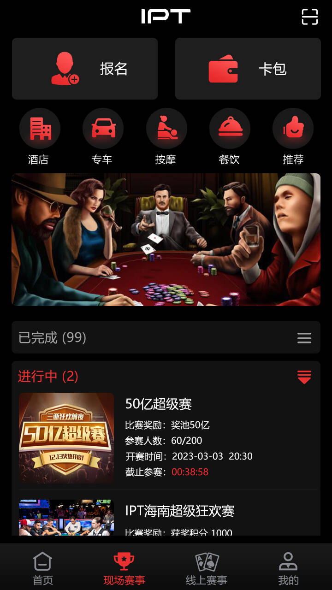
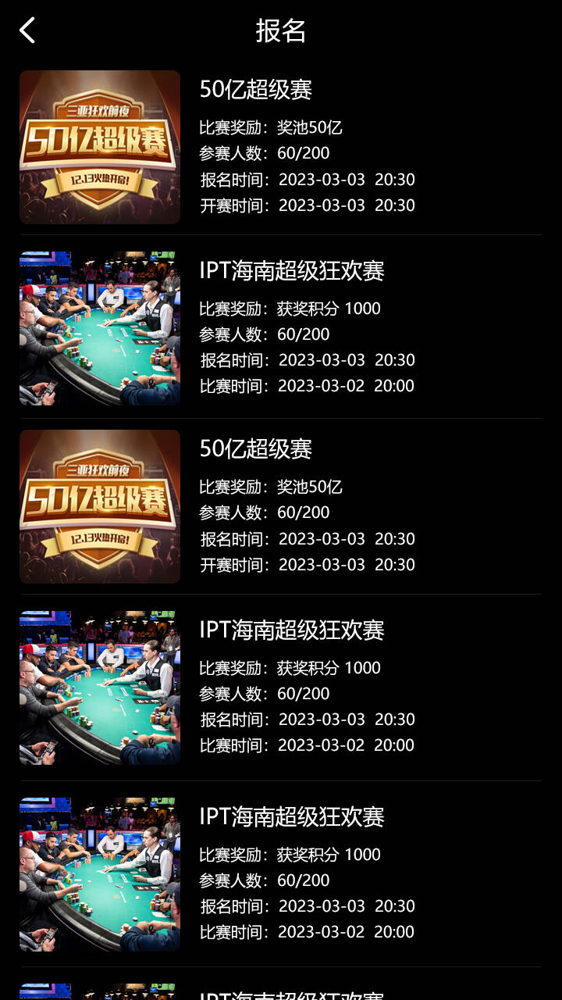
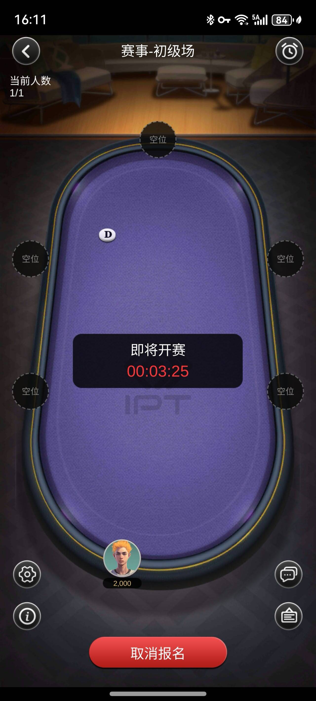
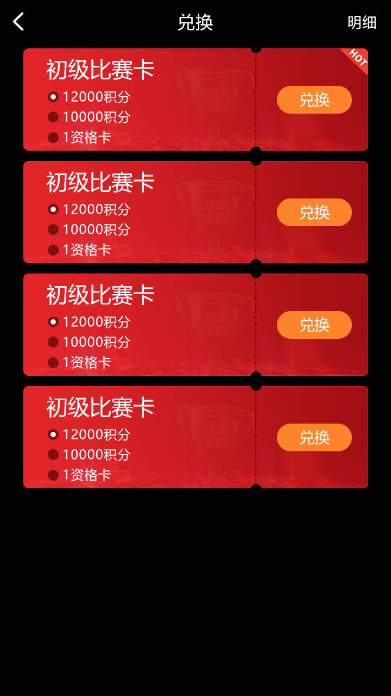

# PokerArena｜德州扑克 SNG、MTT 与竞技赛事平台

[简体中文](README.md) | [繁體中文](README.zh-TW.md) | [English](README.en.md) | [项目主页](https://alibabamayun888.github.io/PokerArena-Competition-Platform/)

<p align="center">
  
  
  
  
</p>

**PokerArena Competition Platform** 是一套面向德州扑克 SNG、MTT、竞技排名赛和线上线下赛事联动的比赛平台。系统采用 **Unity3D 跨平台客户端、C++ 实时游戏服务器和 Java 运营管理后台**，覆盖赛事报名、身份认证、牌桌竞技、盲注升级、淘汰晋级、实时排名、奖励结算与线下比赛门票兑换流程。

项目适用于德州扑克赛事平台开发、多人实时竞技游戏研究、线上资格赛、线下比赛报名和赛事运营系统集成。仓库页面展示的是产品和技术方案；实际部署前请根据代码版本核对模块、依赖与合规要求。

## 目录

- [项目概述](#项目概述)
- [赛事模式](#赛事模式)
- [系统架构](#系统架构)
- [核心功能](#核心功能)
- [客户端](#客户端)
- [游戏服务器](#游戏服务器)
- [管理后台](#管理后台)
- [身份认证与安全](#身份认证与安全)
- [线上与线下赛事门票](#线上与线下赛事门票)
- [产品截图](#产品截图)
- [仓库结构](#仓库结构)
- [运行与部署](#运行与部署)
- [常见问题](#常见问题)
- [合规说明](#合规说明)
- [联系与支持](#联系与支持)

## 项目概述

PokerArena 将线上德州扑克比赛、锦标赛调度、参赛资格、实名与人脸认证、积分排名和线下比赛门票管理整合到统一业务流程中。

```text
赛事发布 → 玩家报名 → 身份与资格校验 → 开赛与分桌
        → 盲注升级 → 淘汰与并桌 → 决赛桌与结算
        → 排名/积分/门票发放 → 线下赛事核销
```

### 技术组成

| 层级 | 技术 | 主要职责 |
| --- | --- | --- |
| 客户端 | Unity3D 2021.3 LTS | iOS / Android 界面、赛事大厅、报名、牌桌与结果展示 |
| 客户端通信 | WebSocket | 实时消息、心跳、断线重连与状态恢复 |
| 游戏服务器 | C++17 / Boost.Asio | 牌局状态、玩家行动、赛事调度与实时同步 |
| 业务后台 | Java 17 / Spring Boot 3.x | 赛事配置、用户审核、门票、运营与风控管理 |
| 数据服务 | MySQL 8.0 / Redis 7.x | 持久化数据、缓存、在线状态与排行榜 |
| 可选中间件 | Kafka / RabbitMQ | 异步事件、日志流水与业务解耦 |
| 身份认证 | 第三方实名认证与人脸识别服务 | 活体检测、身份核验与参赛资格确认 |

## 赛事模式

### MTT 多桌锦标赛

- 多桌同时开赛，按赛事进程动态拆桌和并桌。
- 支持盲注等级、前注、延迟报名、重购和加购等赛事配置。
- 记录淘汰顺序、实时排名、奖励名次和决赛桌结果。

### SNG 单桌快速赛

- 达到预设人数后自动开赛。
- 适合单桌快速竞技、日常赛和固定人数资格赛。
- 可配置买入条件、起始筹码、盲注速度和奖励名次。

### 竞技排名赛

- 支持赛事积分、周期排行榜和赛季晋级规则。
- 可将线上比赛成绩与线下赛事参赛资格关联。
- 适用于系列赛、资格赛和品牌赛事运营。

## 系统架构

```text
┌─────────────────────────────────────────────┐
│                Unity3D 客户端               │
│  赛事大厅 · 报名 · 牌桌 · 排名 · 门票中心   │
└────────────────────┬────────────────────────┘
                     │ WebSocket / API
┌────────────────────▼────────────────────────┐
│                C++ 游戏服务器               │
│  牌局状态 · 发牌 · 行动校验 · 赛事调度 · 结算│
└────────────────────┬────────────────────────┘
                     │ 内部服务接口 / 事件
┌────────────────────▼────────────────────────┐
│                 Java 管理后台               │
│  赛事配置 · 用户审核 · 排名 · 门票 · 风控    │
└────────────────────┬────────────────────────┘
                     │
┌────────────────────▼────────────────────────┐
│       MySQL · Redis · 消息队列 · 认证服务    │
└─────────────────────────────────────────────┘
```

客户端负责显示和交互，关键牌局状态、随机数、行动合法性与比赛结果必须由服务器权威计算。管理后台不直接参与实时发牌，通过受控接口管理赛事和运营数据。

## 核心功能

| 功能 | 说明 |
| --- | --- |
| 赛事大厅 | 展示报名中、进行中和已结束的 SNG、MTT 与竞技赛事 |
| 报名系统 | 管理报名时间、人数、条件、候补、取消与资格检查 |
| 盲注引擎 | 配置盲注级别、升级时间、前注和休息阶段 |
| 赛事调度 | 开桌、分桌、并桌、座位平衡、淘汰和决赛桌管理 |
| 实时牌桌 | 玩家行动、底池、边池、全下和牌局状态同步 |
| 排名与积分 | 更新比赛名次、赛季积分和晋级资格 |
| 奖励结算 | 按赛事规则生成奖励、积分或参赛资格结果 |
| 门票中心 | 线上积分兑换、线下门票领取、状态查询与现场核销 |
| 身份认证 | 实名审核、活体检测和人脸比对流程接入 |
| 牌谱记录 | 保存可审计的赛事与牌局事件，支持复盘和问题定位 |

## 客户端

Unity3D 客户端面向 iOS 与 Android，主要包含：

- 赛事大厅、搜索、筛选和比赛详情。
- 线上赛事与现场赛事入口。
- 报名、取消报名、候场和开赛提醒。
- 实时牌桌、行动操作、聊天和比赛信息。
- 个人中心、积分、资格卡与门票状态。
- 网络中断后的重连和牌局状态恢复。
- 中文、英文及其他语言的本地化扩展能力。

## 游戏服务器

C++ 游戏服务器负责实时、权威的牌局和锦标赛状态：

- 德州扑克状态机与合法行动校验。
- 服务端发牌、底池和边池计算。
- 房间连接、心跳和断线恢复。
- SNG 与 MTT 生命周期管理。
- 盲注升级、拆桌、并桌和座位平衡。
- 淘汰、晋级、排名和最终结算事件。
- 与 Java 后台、缓存和数据服务同步。

并发容量与延迟必须以实际代码版本、硬件、编译参数和压测报告为准。本 README 不提供未经公开基准测试验证的固定性能承诺。

## 管理后台

Java / Spring Boot 管理后台用于赛事与运营管理：

| 模块 | 功能 |
| --- | --- |
| 赛事管理 | 创建赛事模板、配置赛程、盲注、人数与奖励规则 |
| 用户管理 | 用户资料、实名审核、状态限制与参赛记录 |
| 门票管理 | 资格卡、门票库存、发放、领取和核销记录 |
| 内容管理 | 公告、Banner、活动和客户端配置 |
| 数据报表 | 赛事参与、留存、报名和完成情况统计 |
| 风控审计 | 异常事件、设备与账号关联、操作日志和人工复核 |
| 权限管理 | 后台角色、最小权限和敏感操作审批 |

## 身份认证与安全

平台可在账号认证、重要赛事报名、门票领取和现场核销等节点接入实名认证与人脸识别服务。

- 在采集前明确告知用途并取得用户单独同意。
- 人脸图像和生物特征按敏感个人信息实施加密和访问控制。
- C++ 游戏服务器仅获取最小化的认证状态，不保存人脸原始图像。
- 配置保存期限、撤回授权、删除和人工复核流程。
- 对后台管理、认证、报名和领奖接口进行鉴权、限流与审计。
- 使用 TLS 保护传输，密钥和凭据不得提交到公开仓库。

具体接入方式取决于所选择的认证服务和运营地区法规。

## 线上与线下赛事门票

PokerArena 可将线上 SNG、MTT 或积分赛与线下比赛资格连接：

1. 玩家参加线上比赛并获得积分、排名或资格。
2. 系统按活动规则发放比赛卡或线下门票。
3. 玩家在客户端查看和领取资格。
4. 后台完成实名信息与参赛条件审核。
5. 线下现场通过安全凭证或二维码进行核销。
6. 核销结果回写后台，形成完整审计记录。

门票、积分和奖励规则应在报名之前向用户清晰展示。

## 产品截图

以下图片来自当前仓库的 `docs/Assets/Screenshots/` 目录，README 与 GitHub Pages 使用同一组相对路径。

### 现场赛事大厅



### 赛事报名列表



### 竞技比赛牌桌



### 比赛资格卡兑换



## 仓库结构

当前仓库根目录可以看到以下主要内容：

```text
PokerArena-Competition-Platform/
├── Clinet/                    # 当前仓库使用的客户端目录名称
├── Doc/                       # 项目资料
├── Unity-iPhone Tests/        # Unity iPhone 测试工程
├── UnityFramework/            # Unity iOS Framework 工程
├── docs/
│   ├── index.html             # GitHub Pages 中文首页
│   ├── en/index.html          # GitHub Pages 英文页面
│   ├── zh-TW/index.html       # GitHub Pages 繁体中文页面
│   └── Assets/Screenshots/    # 产品截图
├── README.md                  # 简体中文
├── README.zh-TW.md            # 繁体中文
└── README.en.md               # 英文
```

> `Clinet/` 是线上仓库当前存在的目录名。若确认不会影响 Unity 工程引用，可在单独提交中更名为 `Client/`；不要只改 README 而不处理实际路径。

## 运行与部署

线上 README 提供了技术环境信息，但当前仓库根目录未展示完整的 C++ 服务器、Java 后台和数据库部署入口，因此这里不编造不可执行的命令。

发布完整代码后，建议补齐：

- `docs/client-build.md`：Unity 版本、iOS/Android 构建步骤和依赖。
- `docs/game-server-deploy.md`：C++ 编译器、CMake、配置文件和启动命令。
- `docs/admin-deploy.md`：Java、Spring Boot、数据库迁移和环境变量。
- `docs/protocol.md`：客户端与服务器协议版本和兼容策略。
- `docs/benchmark.md`：并发、延迟、硬件和压测方法。
- `.env.example`：不包含任何真实密钥的配置模板。

## 常见问题

### PokerArena 支持哪些德州扑克比赛？

项目定位涵盖 SNG 单桌快速赛、MTT 多桌锦标赛、竞技排名赛、线上资格赛和线下比赛门票联动。

### 客户端和服务器分别使用什么技术？

客户端使用 Unity3D，实时游戏服务器使用 C++，赛事运营与管理后台使用 Java / Spring Boot。

### 是否支持 iOS 和 Android？

线上项目说明定位于 iOS 与 Android 客户端。实际可构建平台和最低系统版本应以当前 Unity 工程设置及构建测试结果为准。

### 人脸识别是否必须启用？

不一定。应根据比赛规则和所在地法规决定。非必要场景不应强制采集生物特征；启用时必须提供隐私说明、明确同意和删除机制。

### 可以直接用于商业运营吗？

能否商用取决于代码完整度、许可证、第三方 SDK 授权、安全测试和当地法律。上线前应完成代码审计、压力测试、隐私影响评估和法律审查。

### 如何查看产品页面？

启用 GitHub Pages 后访问：

<https://alibabamayun888.github.io/PokerArena-Competition-Platform/>

## 合规说明

本项目用于软件开发、赛事管理和技术研究。使用者必须遵守运营地区有关网络游戏、竞技赛事、年龄限制、消费者保护、生物特征信息和数据跨境传输的法律法规。

不得将项目用于未经许可的博彩经营、身份冒用、隐私侵害、比赛操纵或其他违法活动。更多说明见 [PRIVACY.md](PRIVACY.md)、[SECURITY.md](SECURITY.md) 和 [RESPONSIBLE-USE.md](RESPONSIBLE-USE.md)。

## 许可证

当前线上仓库根目录未显示标准 `LICENSE` 文件，因此本 README 不继续声明 MIT 或其他许可证。代码所有者应在发布前选择合适的开源或商业许可证，并添加完整的 `LICENSE` 文件；在此之前，默认版权仍由权利人保留。

## 联系与支持

| 渠道 | 地址 |
| --- | --- |
| Email | <ttpoker40@gmail.com> |
| Telegram | [@alibabama401](https://t.me/alibabama401) |
| Issues | [PokerArena GitHub Issues](https://github.com/alibabamayun888/PokerArena-Competition-Platform/issues) |

如果 PokerArena 对你的德州扑克赛事平台研究有帮助，欢迎通过 Issue 提交可复现的问题与改进建议。
